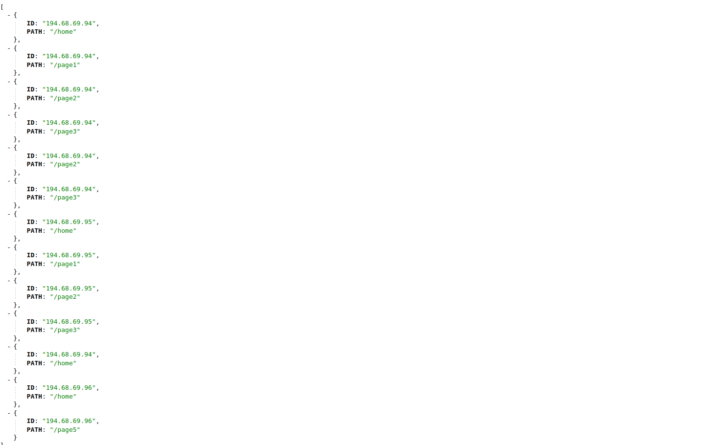
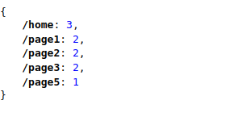

# Prueba Nexiona

## 0. Estado de los requerimientos del test

- [X] Gestionar insercción de eventos individuales via AMPQ.
- [X] Gestionar insercción de eventos individuales via API REST.
- [X] Servir endpoint REST HTTP con número de visitas únicas.
- [X] Servir endpoint REST HTTP con visitas totales.
- [X] Gestionar concurrencia.

## 1. Inicialización del proyecto

Para inicilalizar el proyecto deberemos teclear en el directorio raíz del mismo:

`poetry init`

Con este comando se instalarán las dependencias en un entorno virtual.

## 2. Puesta en marcha del proyecto

Se deben configurar las opciones de la cola de mensaje en el archivo `config.py` completando los siguientes campos:

### Información relacionada con el host de mensajes
`
HOST = "localhost"
VHOST = "%2f"
USER = 'nexiona'
PASSWORD = 'nexiona22'
`

### Información relacionada con AMQP
`
RABBIT_URL = F"amqp://{USER}:{PASSWORD}@{HOST}"
ROUTING_KEY = "nexiona"
QUEUE_NAME = "test.nexiona"
EXCHANGE = "surveillance"
`

Una vez configurados estos valores, podremos pasar a poner el marcha el proyecto yendo a la carpeta nexiona y tecleando:

`poetry run python3 main.py`

## 3. Proyecto en marcha

Una vez cargado el proyecto podremos ver como se ponen el marcha tantos consumidores de cola de AMQP y API REST como hayamos indicado en la constante `THREADS` en el archivo `config.py` y también los endpoints solicitados `/unique` donde se podrán obtener las visitas únicas por página (PATH) y el endpoint `/totals` donde se podrán ver todas las inserciones realizadas en el sistema.

TOTAL ENDPOINT

UNIQUE ENDPOINT

## 4. Testing Manual

Con objeto de realizar un testing manual del envio de mensajes a la cola en la carpeta test se puede encontrar el archivo `testSenderMQ.py` que hace el envío de los mensajes que se introduzcan en la variable `messages`.